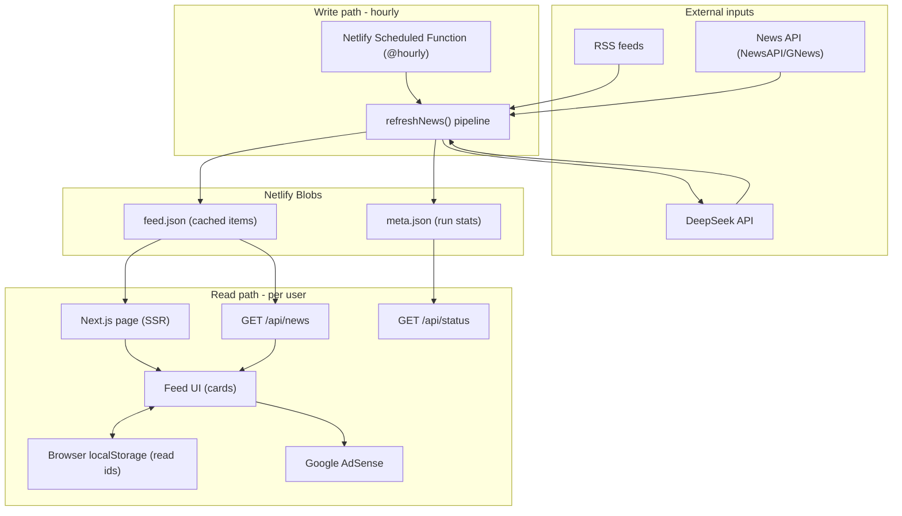
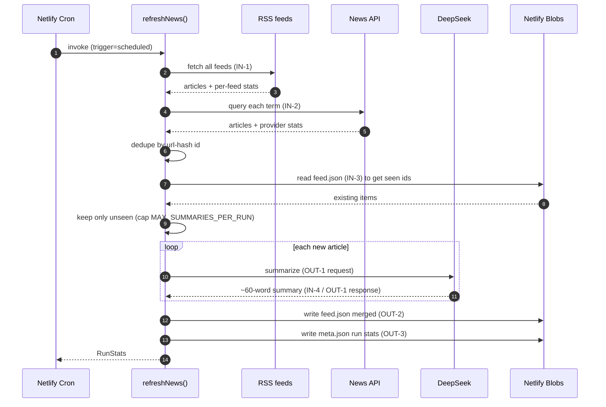
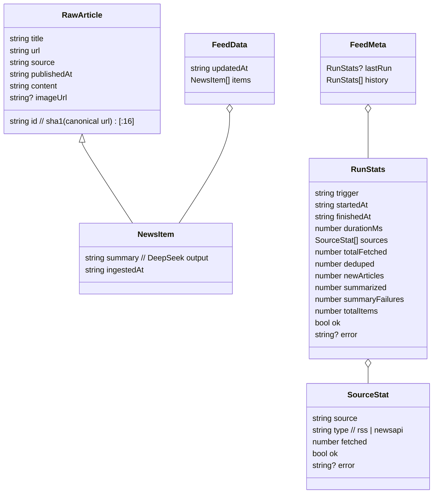

# RealiTea — Architecture & Data Flow

This document maps the **entire system from start to finish** and enumerates **every data input and output point** so each can be tracked, debugged, and reasoned about.

- For endpoint request/response contracts, see [API.md](API.md).
- For setup and deployment, see [../README.md](../README.md).

---

## 1. System at a glance

RealiTea has two independent runtime paths that meet at a shared cache:

1. **Write path (backend, scheduled):** an hourly job pulls raw news, summarizes it with AI, and writes a cached feed. This is the **only** path that touches paid/external services.
2. **Read path (frontend, per-user):** users read the cached feed. Refreshing never calls AI or news sources — it re-reads the cache, and "unread" is computed in the browser.



---

## 2. Component map

| Layer | Component | File | Responsibility |
| --- | --- | --- | --- |
| Trigger | Scheduled function | [netlify/functions/refresh-news.mts](../netlify/functions/refresh-news.mts) | Runs `refreshNews("scheduled")` every hour |
| Trigger | Manual refresh | [app/api/refresh/route.ts](../app/api/refresh/route.ts) | Token-protected `refreshNews("manual")` for warm-up |
| Pipeline | Orchestrator | [lib/refresh.ts](../lib/refresh.ts) | Fetch -> dedupe -> filter -> summarize -> store -> record stats |
| Input | RSS fetcher | [lib/fetchers/rss.ts](../lib/fetchers/rss.ts) | Reads RSS/Atom feeds; per-feed stats |
| Input | News API fetcher | [lib/fetchers/newsapi.ts](../lib/fetchers/newsapi.ts) | Queries NewsAPI/GNews; per-provider stats |
| Transform | Summarizer | [lib/deepseek.ts](../lib/deepseek.ts) | DeepSeek call -> ~60-word summary (+ fallback flag) |
| Storage | Feed store | [lib/feedStore.ts](../lib/feedStore.ts) | Read/write `feed.json` + `meta.json`, merge/dedupe |
| Config | Sources | [lib/sources.ts](../lib/sources.ts) | Feed list, queries, keywords, caps |
| Read | Feed wrapper | [lib/getFeed.ts](../lib/getFeed.ts) | Cache-or-sample fallback (demo mode) |
| Read | News endpoint | [app/api/news/route.ts](../app/api/news/route.ts) | Serves cached items |
| Read | Status endpoint | [app/api/status/route.ts](../app/api/status/route.ts) | Serves run metrics (observability) |
| Read | Page (SSR) | [app/page.tsx](../app/page.tsx) | Server-renders initial feed |
| UI | Feed/cards/ads | [components/Feed.tsx](../components/Feed.tsx), [NewsCard.tsx](../components/NewsCard.tsx), [AdCard.tsx](../components/AdCard.tsx) | Card feed, refresh, unread, ad slots |
| UI state | Read tracking | [lib/readState.ts](../lib/readState.ts) | Per-device read ids in `localStorage` |

---

## 3. End-to-end sequence: hourly aggregation (write path)



---

## 4. End-to-end sequence: user reading (read path)

```mermaid
sequenceDiagram
  autonumber
  participant U as User
  participant P as Next.js SSR page
  participant N as GET /api/news
  participant B as Netlify Blobs
  participant L as localStorage

  U->>P: open app
  P->>B: read feed.json (or sample if empty)
  B-->>P: items
  P-->>U: server-rendered first cards
  U->>L: read ids loaded (IN-5)
  Note over U,L: unread = items not in read set
  U->>U: scroll; card 60% visible -> markRead (OUT-4 to localStorage)
  U->>N: tap Refresh (cheap)
  N->>B: read feed.json
  B-->>N: items
  N-->>U: items + isDemo
  Note over U: rebuild deck = unread only. No AI / news-API calls.
```

---

## 5. Data Input / Output Points (the tracking map)

Every point where data crosses a boundary. `IN` = data entering our system/stage; `OUT` = data leaving a stage to a sink.

| ID | Stage | Dir | From -> To | Payload / Format | Triggered by | Tracked by |
| --- | --- | --- | --- | --- | --- | --- |
| IN-1 | Ingest | IN | RSS feeds -> `fetchRssArticles` | XML/RSS -> `RawArticle[]` | hourly job | `RunStats.sources[type=rss]` (per-feed `fetched`, `ok`, `error`) |
| IN-2 | Ingest | IN | News API -> `fetchNewsApiArticles` | JSON -> `RawArticle[]` | hourly job | `RunStats.sources[type=newsapi]` |
| IN-3 | Dedupe | IN | `feed.json` -> pipeline | `NewsItem[]` (existing ids) | hourly job | `RunStats.deduped` vs `totalFetched` |
| OUT-1 | Summarize | OUT/IN | pipeline <-> DeepSeek | request: title+content; response: summary text | per new article | `RunStats.summarized`, `RunStats.summaryFailures` |
| OUT-2 | Persist feed | OUT | pipeline -> `feed.json` | `FeedData` | hourly job | `RunStats.totalItems`, `feed.updatedAt` |
| OUT-3 | Persist meta | OUT | pipeline -> `meta.json` | `FeedMeta` (lastRun + history) | hourly/manual job | `GET /api/status` |
| IN-5 | Read state load | IN | localStorage -> Feed UI | `string[]` read ids | app open / refresh | client-only (`lib/readState.ts`) |
| OUT-4 | Read state save | OUT | Feed UI -> localStorage | `string[]` read ids | card viewed | client-only |
| OUT-5 | Serve feed | OUT | `feed.json` -> client | JSON `{items,...}` | `GET /api/news` | HTTP status / `count` / `isDemo` |
| OUT-6 | Serve status | OUT | `meta.json` -> client | JSON metrics | `GET /api/status` | response body |
| OUT-7 | Ads | OUT | client -> Google AdSense | ad request | page render | AdSense dashboard |

> Demo fallback: when `feed.json` is empty, OUT-5 and the SSR page emit built-in `SAMPLE_ITEMS` with `isDemo: true` (see [lib/getFeed.ts](../lib/getFeed.ts)). This keeps the frontend fully functional with zero backend setup.

---

## 6. Data model



Defined in [lib/types.ts](../lib/types.ts).

---

## 7. Storage layout (Netlify Blobs)

Store name: `realitea`.

| Key | Type | Written by | Read by |
| --- | --- | --- | --- |
| `feed.json` | `FeedData` | `writeFeed` (pipeline) | `readFeed` (page, `/api/news`, `/api/status`) |
| `meta.json` | `FeedMeta` | `appendRunStats` (pipeline) | `readMeta` (`/api/status`) |

Rolling caps: feed keeps the latest `FEED_MAX_ITEMS` (500); meta keeps the last `META_HISTORY` (20) runs.

---

## 8. Why refresh is "free" (the core requirement)

- DeepSeek (OUT-1) and the news sources (IN-1, IN-2) are only invoked by the **hourly job**.
- User refreshes hit **OUT-5** (`/api/news`), which only reads the cached blob (CDN-cacheable).
- "Unread" is derived client-side by diffing item ids against `localStorage` (IN-5/OUT-4) — no server call needed to know what a user has seen.
- Net effect: cost and rate-limit pressure are bounded by the hourly job, independent of traffic.

---

## 9. Failure handling & fallbacks

| Failure | Behavior | Where |
| --- | --- | --- |
| A single RSS feed errors | Skipped; recorded as `ok:false` with `error` | `lib/fetchers/rss.ts` |
| News API key missing/limit | Source skipped; RSS still works | `lib/fetchers/newsapi.ts` |
| DeepSeek error/empty | Fallback to truncated content; counts as `summaryFailures` | `lib/deepseek.ts` |
| Blobs read fails | Returns empty feed -> demo content | `lib/feedStore.ts`, `lib/getFeed.ts` |
| Meta write fails | Logged, never breaks the run | `lib/feedStore.ts` |
| Whole run throws | `RunStats.ok=false` + `error`, still recorded | `lib/refresh.ts` |

---

## 10. Cost & rate-limit controls

| Control | Value | File |
| --- | --- | --- |
| Summaries per run | `MAX_SUMMARIES_PER_RUN` = 40 | `lib/sources.ts` |
| Feed size cap | `FEED_MAX_ITEMS` = 500 | `lib/sources.ts` |
| News API pacing | 250ms between queries | `lib/fetchers/newsapi.ts` |
| Run cadence | `@hourly` | `netlify/functions/refresh-news.mts` |

---

## 11. Deployment topology

- **Host:** Netlify (Next.js runtime via `@netlify/plugin-nextjs`).
- **Compute:** Next.js route handlers + one scheduled function.
- **State:** Netlify Blobs (no external DB).
- **External:** DeepSeek (summaries), NewsAPI/GNews (optional), Google AdSense (revenue).
- **Config:** environment variables (see [../.env.example](../.env.example)).
